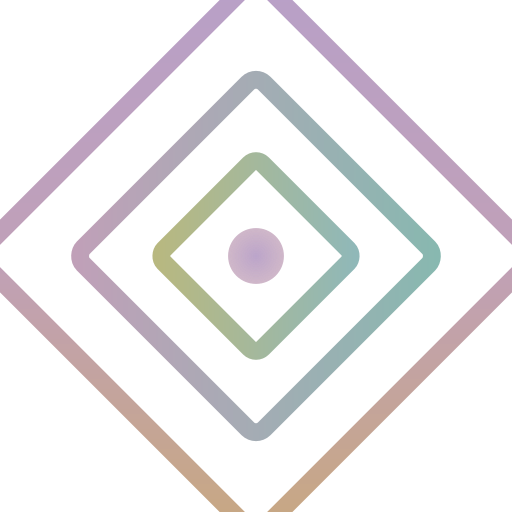
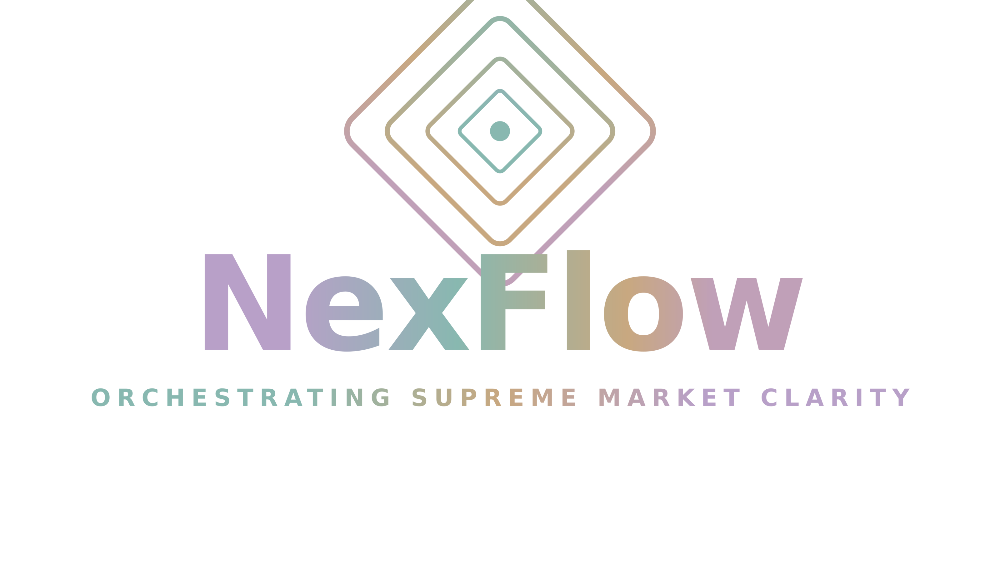

# 01 — Brand, Palette & Motion Guide

> **Document scope:** the visual language of NexFlow — the Chameleon DNA color palette, the diamond-mark logo system, the Living Mesh background, motion conventions in the web app, and the two pre-built motion-logo HTML files.

---

## 1. Brand essence

NexFlow is an AI-native B2B CRM and sales operating system designed for the GCC. The brand has three personality vectors that the visual system must always express:

| Vector | What it means visually |
| --- | --- |
| **Calm intelligence** | Muted, low-saturation palette. Generous negative space. No hard primary colors. |
| **Living, in-motion** | Backgrounds that drift and breathe. Strokes that flow. Subtle pulses on hero marks. |
| **Sovereign / GCC-credible** | Premium glassmorphism cards, gradient accents that read as gold/jewelry rather than neon. |

The internal codename for this system is **"NexFlow Full Blend"**. It is implemented in three places that must stay in lock-step:

1. The web app: `artifacts/nexflow/src/index.css` (CSS variables) and `artifacts/nexflow/src/components/layout/LivingMesh.tsx`.
2. The two motion-logo HTML stand-alones: `attached_assets/nexflow_motion_logo_1776941293968.html` and `attached_assets/nexflow_motion_logo_2_1776941293968.html` (also copied to `docs/assets/motion_logo_1.html` and `docs/assets/motion_logo_2.html`).
3. The marketing demo video: `artifacts/marketing-demo-video/`.

---

## 2. The Chameleon DNA palette

Six muted hues + two neutrals. Every palette token has a semantic role; never use a hex value out of context.

| Token | Hex | RGB | HSL | Role |
| --- | --- | --- | --- | --- |
| **Primary — Soft Muted Lavender** | `#B8A0C8` | rgb(184, 160, 200) | hsl(276, 32%, 71%) | Brand color. Active nav, primary buttons, focus rings, hero accents. |
| **Secondary — Warm Rose-Mauve** | `#C0A0B8` | rgb(192, 160, 184) | hsl(322, 23%, 69%) | Soft contrast pair to Primary. Used on inactive nav state, secondary tags. |
| **Growth — Desaturated Seafoam** | `#88B8B0` | rgb(136, 184, 176) | hsl(170, 25%, 63%) | Positive deltas, "Active", success states, "edit" permission, MRR up. |
| **Wealth — Muted Sand / Amber** | `#C8A880` | rgb(200, 168, 128) | hsl(33, 41%, 64%) | Currency, revenue, demo-mode badge, premium / paid surfaces. |
| **Interface — Mist Green-Blue** | `#90B8B8` | rgb(144, 184, 184) | hsl(180, 22%, 64%) | UI chrome accents, secondary chips, info pills. |
| **Highlight — Muted Olive-Lemon** | `#B8B880` | rgb(184, 184, 128) | hsl(60, 32%, 61%) | Sparingly: notifications, "new" badges, AI-generated highlights. |
| **Base — Warm Off-White** | `#F5F2F6` | rgb(245, 242, 246) | hsl(285, 25%, 96%) | Default page background (light mode body). |
| **Ink — Deep Plum** | `#3E2F4A` | rgb(62, 47, 74) | hsl(273, 22%, 24%) | Body text, headings, dark-mode background base. |

CSS variables (from `artifacts/nexflow/src/index.css`):

```css
:root {
  --nf-primary:   #B8A0C8;  /* Lavender   */
  --nf-secondary: #C0A0B8;  /* Rose-Mauve */
  --nf-growth:    #88B8B0;  /* Seafoam    */
  --nf-wealth:    #C8A880;  /* Sand       */
  --nf-interface: #90B8B8;  /* Mist       */
  --nf-highlight: #B8B880;  /* Olive      */
}
```

### 2.1 Swatch board

| Lavender `#B8A0C8` | Rose-Mauve `#C0A0B8` | Seafoam `#88B8B0` | Sand `#C8A880` | Mist `#90B8B8` | Olive `#B8B880` | Base `#F5F2F6` | Ink `#3E2F4A` |
| :-: | :-: | :-: | :-: | :-: | :-: | :-: | :-: |
| <span style="display:inline-block;width:46px;height:46px;background:#B8A0C8;border-radius:8px;border:1px solid #ddd"></span> | <span style="display:inline-block;width:46px;height:46px;background:#C0A0B8;border-radius:8px;border:1px solid #ddd"></span> | <span style="display:inline-block;width:46px;height:46px;background:#88B8B0;border-radius:8px;border:1px solid #ddd"></span> | <span style="display:inline-block;width:46px;height:46px;background:#C8A880;border-radius:8px;border:1px solid #ddd"></span> | <span style="display:inline-block;width:46px;height:46px;background:#90B8B8;border-radius:8px;border:1px solid #ddd"></span> | <span style="display:inline-block;width:46px;height:46px;background:#B8B880;border-radius:8px;border:1px solid #ddd"></span> | <span style="display:inline-block;width:46px;height:46px;background:#F5F2F6;border-radius:8px;border:1px solid #ddd"></span> | <span style="display:inline-block;width:46px;height:46px;background:#3E2F4A;border-radius:8px;border:1px solid #ddd"></span> |

### 2.2 Where each color is used in-app

| Color | Web app usage (concrete) |
| --- | --- |
| **Lavender `#B8A0C8`** | Active nav-item icon (`TopBar.tsx`), `nf-chameleon-bg` gradient stop, primary button background, `Lead Stage` pill on contact profile, focus ring on inputs. |
| **Rose-Mauve `#C0A0B8`** | "Hidden" permission state in `permissions.tsx`, secondary chip variants, `nf-chameleon-bg` second stop. |
| **Seafoam `#88B8B0`** | "Edit" permission, "Saved" toast, positive KPI delta, `Active` campaign chip, sandbox / safe-action color. |
| **Sand `#C8A880`** | `DEMO MODE` chip in avatar dropdown, currency / revenue values, "Wealth" tag in capabilities. |
| **Mist `#90B8B8`** | Quiet info chips, secondary tag color in segments, channel chips in `messages.tsx`. |
| **Olive `#B8B880`** | Notification badge gradient stop, "AI-generated" sparkle accents, callouts in dashboards. |
| **Base `#F5F2F6`** | Default page background; the Living Mesh sits on this base. |
| **Ink `#3E2F4A`** | Body text in light mode; background in dark mode. |

### 2.3 Accessibility — contrast pairings

WCAG 2.1 AA requires a contrast ratio of **4.5:1** for normal text and **3:1** for large text (≥18 px / 14 px bold).

| Foreground | Background | Ratio | OK for |
| --- | --- | --- | --- |
| Ink `#3E2F4A` | Base `#F5F2F6` | **12.74 : 1** | All text. ✅ |
| Ink `#3E2F4A` | Lavender `#B8A0C8` | **5.34 : 1** | Body & large text. ✅ |
| Ink `#3E2F4A` | Seafoam `#88B8B0` | **5.91 : 1** | Body & large text. ✅ |
| Ink `#3E2F4A` | Sand `#C8A880` | **6.65 : 1** | Body & large text. ✅ |
| White `#FFFFFF` | Lavender `#B8A0C8` | **2.46 : 1** | Decorative only — **fails** body text. ⚠️ Use Ink instead. |
| White `#FFFFFF` | Seafoam `#88B8B0` | **2.22 : 1** | Decorative only. ⚠️ |
| White `#FFFFFF` | Ink `#3E2F4A` | **12.74 : 1** | All text. ✅ |
| Lavender `#B8A0C8` | Base `#F5F2F6` | **2.39 : 1** | Large display only. ⚠️ |

> **Rule:** when placing text on any chameleon hue, default to **Ink `#3E2F4A`**, not white. White is only acceptable when the chameleon hue is used inside a gradient pill ≥14 px bold and the user can dismiss it (chips, badges).

### 2.4 Dos and don'ts

✅ **Do**
- Pair one chameleon accent with neutral surfaces. Single-color callouts, never a rainbow.
- Use the `nf-chameleon-bg` gradient (Lavender → Seafoam → Sand) for hero CTAs, brand pills, and the active-nav indicator.
- Keep text on Ink for body, Lavender for emphasized links, Seafoam for success messages, and the destructive token only for delete.
- Maintain ≥24 px clear space inside any chameleon-colored tile.

❌ **Don't**
- Don't introduce neon or pure RGB colors. The palette is muted by design.
- Don't put 14 px white text directly on Lavender / Seafoam / Mist (contrast fails).
- Don't apply the chameleon gradient to body backgrounds — it is reserved for ≤120 px wide brand surfaces (logos, pills, hero CTAs).
- Don't tint icons in two hues at once. Pick one chameleon color per icon.

---

## 3. Logo system

NexFlow has two lockups.

### 3.1 The mark (`logo_mark`)

Four concentric rotated rounded-rectangle "diamonds" in chameleon-gradient strokes, with a central gradient dot.

- Source: `artifacts/nexflow/public/logo_mark_hires.svg` (1024×1024) and `artifacts/nexflow/src/assets/logo_mark.png` (raster).
- Symbolic meaning: nested diamonds = orchestrated layers of work; the center dot = the customer, the focal point of every flow.
- Used in: `TopBar.tsx` at 28 px, mobile app splash, favicons, in-app loading states, Marketing Demo intro/outro.



### 3.2 The full lockup (`logo_full`)

Mark + "NexFlow" wordmark in a chameleon-gradient text fill + tagline `ORCHESTRATING SUPREME MARKET CLARITY`.

- Source: `artifacts/nexflow/public/logo_full_hires.svg` (1600×900) and `artifacts/nexflow/public/NexFlow_Logo_Full_3200.png` (PNG 3200 px).
- Used in: TopBar wordmark slot (`NexFlowWordmark` component, fixed at 160 px wide), login page, marketing demo final scene, exported PDF reports, email templates.



### 3.3 Clear space, minimum sizes, and don'ts

| Lockup | Clear space | Min size (digital) | Min size (print) |
| --- | --- | --- | --- |
| Mark | ½ × the diamond width on every side | 24 px | 12 mm |
| Full | 1× cap height of "N" on every side | 120 px wide | 30 mm wide |

**Don't:**
- Don't tint the mark a single solid color. The chameleon gradient is the brand.
- Don't place the lockup on photography without a 90 % opacity Base `#F5F2F6` backdrop.
- Don't stretch, skew, rotate, or recompose the diamonds.
- Don't substitute the wordmark font with anything that isn't Arial Black / Inter Black / SF Pro Black.

### 3.4 Code reference

The React component that renders the mark and the wordmark in the app (`artifacts/nexflow/src/components/layout/NexFlowLogo.tsx`):

```tsx
export function NexFlowLogo({ size = 36 }: { size?: number }) {
  return ;
}

export function NexFlowWordmark({ className }: { className?: string }) {
  return ;
}
```

### 3.5 Download links (in-repo)

| Format | Path |
| --- | --- |
| Mark — SVG, hi-res | `artifacts/nexflow/public/logo_mark_hires.svg` |
| Mark — PNG | `artifacts/nexflow/src/assets/logo_mark.png` |
| Full — SVG, hi-res | `artifacts/nexflow/public/logo_full_hires.svg` |
| Full — PNG, 3200 px | `artifacts/nexflow/public/NexFlow_Logo_Full_3200.png` |
| Mark — PNG, 512 px | `attached_assets/logo_mark_512_1776941293968.png` |
| Full — PNG, 1600 px | `attached_assets/logo_full_1600_1776941293968.png` |

---

## 4. Living Mesh — the brand background

NexFlow's signature background is a **10-node animated radial-gradient mesh**. Each node is a chameleon-colored blurred blob that drifts on its own non-repeating loop (22–34 s), creating a session-unique pattern.

Source: `artifacts/nexflow/src/components/layout/LivingMesh.tsx` (renders 10 absolute-positioned nodes); CSS in `artifacts/nexflow/src/index.css`. Mounted at `App.tsx` root with `z-[-1]` so it sits behind every page.

Specs:
- Node size: `55vmax` × `55vmax`
- Blur: `60px`
- Mix-blend-mode: `normal` (`screen` only in dark mode)
- Opacities: `0.14 → 0.36` per node (lower = further away)
- Animation timings: `22s, 24s, 25s, 26s, 27s, 28s, 30s, 31s, 32s, 34s` — coprime so the pattern never visually repeats inside a session.

**Rule:** never put text directly on the mesh; always use a `glass-panel` (translucent white card with backdrop-blur) on top.

---

## 5. Motion conventions

The web app uses **Framer Motion** (`framer-motion` from the catalog). The following are the canonical NexFlow motion tokens:

### 5.1 Durations

| Token | ms | Use |
| --- | --- | --- |
| `instant` | 100 | Hover state, color flips. |
| `quick` | 180 | Button press, dropdown open/close, tab switch. |
| `default` | 280 | Card mount, modal in/out. |
| `slow` | 480 | Page transitions, hero reveals. |
| `breathe` | 2400 | Pulse loops on the mark and on `nf-chameleon-bg` pills. |

### 5.2 Easings

| Token | cubic-bezier | Feel |
| --- | --- | --- |
| `easeOut` | `[0.16, 1, 0.3, 1]` | Snap-in: items arriving on screen. |
| `easeInOut` | `[0.65, 0, 0.35, 1]` | Symmetric: hover-in/out, modal in/out. |
| `circOut` | `cubicBezier(0.0, 0.55, 0.45, 1)` | Pulse / heartbeat curves on the mark. |
| `spring-snappy` | stiffness 400, damping 32 | Drag-and-drop reorders (Pipeline kanban). |
| `spring-bouncy` | stiffness 300, damping 18 | "Aha" reveals (AI-generated content). |

### 5.3 Stagger patterns

| Stagger | seconds | Use |
| --- | --- | --- |
| `fast` | 0.05 | Mega-dropdown tile reveal (TopBar). |
| `medium` | 0.1 | Dashboard widget mount, list rows. |
| `slow` | 0.2 | Hero scene reveals in the marketing demo video. |

### 5.4 Reusable transitions used across the app

| Name | What it does | Where |
| --- | --- | --- |
| `fadeBlur` | opacity 0→1 + blur 12 px→0 | Page mounts, hero AI text reveals. |
| `scaleFade` | scale 0.96→1 + opacity 0→1 | Cards, modals. |
| `slideUp` | y +12 px → 0 + opacity 0→1 | List items, kanban cards on first paint. |
| `morphExpand` | width auto-grow + opacity 0→1 | Inline AI completion appearing in inputs. |
| `pulseGradient` | background-position loop, 6 s | The chameleon gradient on hero marks. |

### 5.5 Cross-reference

The marketing-demo-video artifact (`artifacts/marketing-demo-video/src/lib/video/animations.ts`) is the **authoritative source** for the motion tokens — both the web app and the demo video should import from / mirror that file when adding new animations.

---

## 6. The two motion-logo HTML files

Two stand-alone HTML demos of the Full-Blend brand system live in `attached_assets/`. They are reference pieces — designers should open them in a browser to see the canonical motion treatment before designing anything new.

### 6.1 `nexflow_motion_logo_1.html`

Path: `attached_assets/nexflow_motion_logo_1776941293968.html` → mirrored to `docs/assets/motion_logo_1.html`.

What it shows:
- The **Living Mesh** with 10 chameleon-colored radial nodes drifting on coprime loops.
- The **mark** centered, with two layered animations:
  1. `pulse` — heartbeat scale 1.00 → 1.05 every 2.4 s.
  2. `chameleon-stroke` — strokes cycle through Lavender → Seafoam → Sand → Rose-Mauve every 6 s.
- The **wordmark** below the mark with a slow gradient sweep on the text fill (10 s loop).
- Initial "draw-on" using `stroke-dashoffset 400 → 0` over 2.2 s.

This is the canonical reference for: stroke widths, pulse timing, gradient-sweep timing, blur radius for the mesh nodes.

### 6.2 `nexflow_motion_logo_2.html`

Path: `attached_assets/nexflow_motion_logo_2_1776941293968.html` → mirrored to `docs/assets/motion_logo_2.html`.

> **Status (April 2026):** in the current repo, `motion_logo_2.html` is **byte-identical to `motion_logo_1.html`** (both files have MD5 `7117fbf0c3bfa8d0b5c032043008d80c`, both are 13,230 bytes, originally exported from `attached_assets/nexflow_motion_logo_2_1776941293968.html`). The "_2" filename is reserved as a slot for the elaborated variant described below; that variant has **not yet been authored**. Treat anything beyond §6.1 as planned content, not shipped behavior.

Planned (slot-2) variant — to be implemented:
- Same Living Mesh as #1.
- Adds an **orbital flow ring** around the mark (1-px stroke, chameleon gradient, 24 s rotation).
- Adds the tagline `ORCHESTRATING SUPREME MARKET CLARITY` below the wordmark with a separate 10-second tagline gradient loop.
- Intended for hero / loader screens that need more presence.

When the variant is built, replace `attached_assets/nexflow_motion_logo_2_*.html` and copy the new file over `docs/assets/motion_logo_2.html` so the PDF embed uses the updated source. (`docs/render_pdf.py` reads markdown only — brand assets in `docs/assets/` are managed manually.)

### 6.3 How to view

```bash
# from the repo root
xdg-open docs/assets/motion_logo_1.html
xdg-open docs/assets/motion_logo_2.html
```

Or open them in any browser. They are pure HTML/CSS — no build step, no dependencies.

---

## 7. Typography (current state)

The web app currently uses the system stack via Tailwind defaults: `'Segoe UI', -apple-system, BlinkMacSystemFont, sans-serif`. The wordmark uses **Arial Black** (in the SVG `<text>` element). When migrating to a hosted font, use **Inter** for UI and **Inter Display Black** for the wordmark — both are the closest open-source matches and are already available via the Expo `@expo-google-fonts/inter` package on mobile.

---

## 8. Quick sign-off checklist

Before any new screen, marketing asset, or component is shipped:

- [ ] Background is Base `#F5F2F6` (or Living Mesh + glass-panel cards).
- [ ] No more than **two** chameleon hues per screen.
- [ ] Body text is Ink `#3E2F4A`, not pure black.
- [ ] All text on chameleon backgrounds passes WCAG AA (use the table in §2.3).
- [ ] Animations use the durations & easings in §5.
- [ ] Logo lockup respects clear space and minimum size in §3.3.
- [ ] No icon uses two chameleon colors.
- [ ] Demo / sample data is flagged with the Sand `#C8A880` `DEMO MODE` chip.
