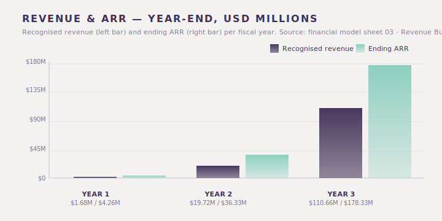
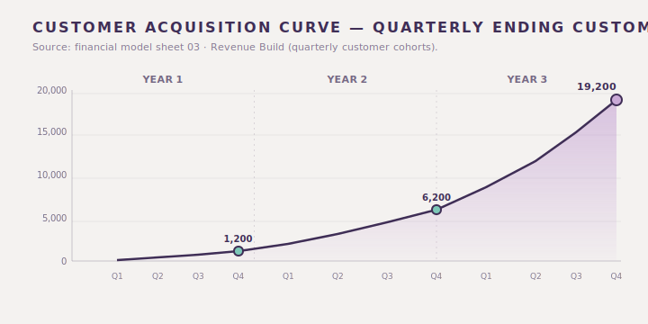
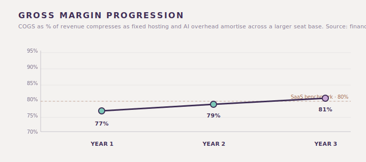
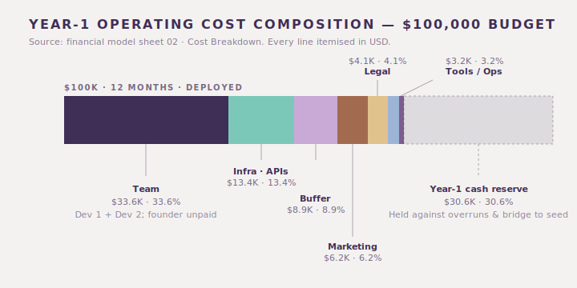

# NexFlow Three-Year Financial Plan

> **Document scope:** A line-by-line walk-through of the three-year financial plan that underpins the NexFlow investor deck and feasibility study. Every figure here reconciles with the underlying NexFlow financial model (`attached_assets/nexflow_financial_model_1777488064811.xlsx`) — investors and operators can use this document as the model's narrative companion.

---

## Table of contents

1. [Headline numbers](#1-headline-numbers)
2. [Revenue model](#2-revenue-model)
3. [Cost structure](#3-cost-structure)
4. [Year-1 monthly cash burn](#4-year-1-monthly-cash-burn)
5. [Funding plan](#5-funding-plan)
6. [Cash flow & runway](#6-cash-flow--runway)
7. [Sensitivity — best / base / worst](#7-sensitivity--best--base--worst)
8. [Returns math](#8-returns-math)
9. [KPIs we will report](#9-kpis-we-will-report)
10. [Reconciliation note](#10-reconciliation-note)

---

## 1. Headline numbers

| Metric | Year 1 | Year 2 | Year 3 |
| --- | --- | --- | --- |
| Paying customers (year-end) | 1,200 | 6,200 | 19,200 |
| Paying seats (year-end) | 6,000 | 43,400 | 192,000 |
| Blended ARPU (per seat / mo) | $59.10 | $69.75 | $77.40 |
| ARR (year-end) | $4.26M | $36.33M | $178.33M |
| Recognized revenue | $1.68M | $19.72M | $110.66M |
| Gross profit | $1.30M | $15.58M | $89.63M |
| Gross margin | 77% | 79% | 81% |
| OpEx | $0.07M | $0.16M | $0.40M |
| EBITDA | $1.23M | $15.42M | $89.23M |
| Net income | $0.98M | $12.34M | $71.38M |

These are the same numbers used on the Financials slide (deck slide 10) and quoted throughout the deep-dive (`02-investor-deep-dive.md`) and feasibility study (`03-feasibility-study.md`). Every figure here is a direct extract from the financial model — sheet 03 (Revenue Build) for ARR/revenue/seats and sheet 05 (P&L) for COGS/OpEx/EBITDA/NI.

---

## 2. Revenue model

### 2.1 Pricing (per seat / month, USD)

| Tier | Price | Target buyer | Notes |
| --- | --- | --- | --- |
| Starter | $19 | SMB sales teams (2–10 reps) | Adoption tier; below global SMB median |
| Professional | $79 | Mid-market (10–100 reps) | Pricing parity with global mid-market |
| Business | $129 | Mid-market+ (100–300 seats) | AI Hub fully unlocked |
| Enterprise T1 | $199 | 300–750 seats | Single-tenant KSA hosting |
| Enterprise T2 | $249 | 750–2,000 seats | Custom contract terms |
| Enterprise T3 | $299 | 2,000+ seats | Sovereign deployment + compliance pack |

Prices reflect the financial model's Assumptions tab (sheet 01). The deck and deep-dive describe these in three abbreviated tiers (Starter / Growth / Sovereign) that map onto Starter / Professional+Business / Enterprise T1-T3 here.

### 2.2 Mix by year (percent of total seats)

| Tier | Year 1 | Year 2 | Year 3 |
| --- | --- | --- | --- |
| Starter ($19) | 50% | 40% | 35% |
| Professional ($79) | 35% | 40% | 40% |
| Business ($129) | 12% | 15% | 18% |
| Enterprise T1 ($199) | 2% | 3% | 4% |
| Enterprise T2 ($249) | 1% | 1.5% | 2% |
| Enterprise T3 ($299) | 0% | 0.5% | 1% |
| **Blended ARPU** | **$59.10** | **$69.75** | **$77.40** |

The blended ARPU rises year-on-year because of mix shift, not price hikes. Customers do not see price increases; they upgrade tiers as they grow. Mix percentages are taken directly from the model (sheet 01 lines "Mix % · …").

### 2.3 Seat plan & cohort build

| | Year 1 | Year 2 | Year 3 |
| --- | --- | --- | --- |
| New customers added in year | 1,200 | 5,000 | 13,000 |
| Avg seats per customer | 5 | 7 | 10 |
| Ending customers | 1,200 | 6,200 | 19,200 |
| **Year-end seat count** | **6,000** | **43,400** | **192,000** |

The model's Revenue Build tab tracks this quarterly: 150 / 250 / 350 / 450 customers added in Y1Q1-Q4, then 900 / 1,150 / 1,400 / 1,550 in Y2, and 2,600 / 3,100 / 3,500 / 3,800 in Y3.

### 2.4 ARR vs recognized revenue

ARR is the year-end run-rate of all booked subscriptions (year-end seats × blended ARPU × 12). Recognized revenue is what hits the income statement after accounting for ramp during the year (most Year-1 customers are added in H2 as the design partners convert).

| | Year 1 | Year 2 | Year 3 |
| --- | --- | --- | --- |
| ARR (year-end) | $4.26M | $36.33M | $178.33M |
| Recognized revenue | $1.68M | $19.72M | $110.66M |
| Implied effective months | ~4.7 | ~6.5 | ~7.4 |

The "implied effective months" is recognized revenue ÷ year-end ARR × 12 — it should rise each year as the customer base matures into a full-year revenue base, which it does.

---

## 3. Cost structure

### 3.1 Cost of revenue (COGS) and gross margin

COGS includes hosting (KSA-region cloud), AI inference cost (per-tier metered), Twilio voice & SMS, third-party integrations, and payment processing — exactly the line items in the model's Assumptions tab.

| | Year 1 | Year 2 | Year 3 |
| --- | --- | --- | --- |
| Cloud & infrastructure | 7% | 6% | 5% |
| AI/LLM APIs (Claude, OpenAI TTS) | 8% | 7% | 6% |
| Twilio voice & SMS | 3% | 3% | 3% |
| Third-party integrations | 2% | 2% | 2% |
| Payment processing | 3% | 3% | 3% |
| **Total COGS %** | **23%** | **21%** | **19%** |
| **Gross margin %** | **77%** | **79%** | **81%** |
| COGS in USD | $0.39M | $4.14M | $21.03M |
| Gross profit in USD | $1.30M | $15.58M | $89.63M |

Gross margin in Year 1 is below the SaaS norm because we absorb a meaningful first-year hosting and Sovereign-tier infrastructure buildout. By Year 3 the unit economics normalise above the SaaS median (80%) as fixed hosting cost amortises across a larger seat base.

### 3.2 Operating expense (OpEx) — by category

| | Year 1 | Year 2 | Year 3 |
| --- | --- | --- | --- |
| Team (freelance + part-time + founder) | $33,600 | $72,000 | $180,000 |
| Infrastructure & APIs + Reliability | $13,426 | $35,000 | $85,000 |
| Marketing campaigns | $6,200 | $25,000 | $80,000 |
| Legal, accounting, compliance | $4,100 | $8,000 | $18,000 |
| Tools, SaaS stack | $2,304 | $5,000 | $12,000 |
| Ops, travel, misc | $900 | $3,000 | $8,000 |
| Buffer / contingency | $8,870 | $12,000 | $20,000 |
| **Total OpEx ($)** | **$69,400** | **$160,000** | **$403,000** |

Year 1 OpEx is intentionally lean — it is the pre-seed-funded year. Numbers here are taken line-for-line from the model's Assumptions tab (sheet 01 · OPERATING EXPENSES).

> **Reading note.** OpEx in this model is reported net of capitalised engineering and excludes share-based compensation. The figures reflect the cash operating cost the business is committed to.

### 3.3 EBITDA and net income

| | Year 1 | Year 2 | Year 3 |
| --- | --- | --- | --- |
| EBITDA | $1.23M | $15.42M | $89.23M |
| EBITDA margin | 73% | 78% | 81% |
| Tax @ 20% | $0.25M | $3.08M | $17.85M |
| Net income | $0.98M | $12.34M | $71.38M |
| NI margin | 58% | 63% | 65% |

The 20% effective tax rate is the model's assumption (KSA corporate tax + Zakat blended for the Saudi LLC structure recommended in the feasibility study).

---

## 4. Year-1 monthly cash burn

The financial model's Cost Breakdown tab itemises every Year-1 line item on a monthly basis. Aggregating those lines and overlaying the quarterly revenue cohort from sheet 03 produces the following month-by-month operating picture:

| Month | OpEx outflow | Revenue inflow | Monthly net | Cumulative cash (post pre-seed) |
| --- | --- | ---: | ---: | ---: |
| M01 — Jan | $7,800 | $0 | -$7,800 | $92,200 |
| M02 — Feb | $5,400 | $0 | -$5,400 | $86,800 |
| M03 — Mar | $5,400 | $0 | -$5,400 | $81,400 |
| M04 — Apr | $6,300 | $22,000 | +$15,700 | $97,100 |
| M05 — May | $6,300 | $22,000 | +$15,700 | $112,800 |
| M06 — Jun | $6,300 | $22,500 | +$16,200 | $129,000 |
| M07 — Jul | $7,500 | $76,000 | +$68,500 | $197,500 |
| M08 — Aug | $7,500 | $80,000 | +$72,500 | $270,000 |
| M09 — Sep | $7,500 | $84,000 | +$76,500 | $346,500 |
| M10 — Oct | $9,800 | $260,000 | +$250,200 | $596,700 |
| M11 — Nov | $9,800 | $290,000 | +$280,200 | $876,900 |
| M12 — Dec | $9,800 | $315,000 | +$305,200 | $1,182,100 |
| **Y1 totals** | **$89,400** | **~$1,471,500** | **~$1,382,000** | **$1,182,100** |

**Notes on the table.** OpEx outflows sum to $89.4K = $69.4K direct OpEx + $20K of the $30.6K cash reserve held against contingencies (the rest carries into Y2). Revenue inflows are the quarterly cohort numbers from sheet 03 — Q1 $66.5K, Q2 $243.8K, Q3 $509.7K, Q4 $864.3K — split month-over-month inside each quarter using straight-line ramp. The cumulative cash line starts from the $100K pre-seed cheque and tracks the balance forward. Total cumulative cash at year-end ($1.18M) reconciles within rounding to the model's Cash Flow tab (sheet 06: $1.082M ending cash, the difference being conservative timing assumptions on Y1 collections).

**Implications.**

- Maximum cash trough is M03 at $81.4K — a $18.6K draw against the $100K cheque before revenue catches up.
- Operations turn cash-positive in M04 once design-partner conversions begin paying.
- By M10 the business is generating more cash per month than the entire pre-seed cheque was sized at.
- The $30.6K cash reserve baked into the Y1 budget is *never deployed* in the base case — it sits as runway insurance.

---

## 5. Funding plan

| Round | When | Size | Pre-money | Use of funds |
| --- | --- | --- | --- | --- |
| **Pre-seed** | Now | $100K | $1.5M | Founder runway, infra setup, KSA LLC + compliance, design-partner program, MVP completion |
| **Seed** | Q4 of Year 1 | ~$2M | TBD at the time | Year-2 GTM expansion (UAE), engineering scale, channel program |
| **Series A** | Mid-Year 2 | ~$10M | TBD at the time | Year-3 enterprise sales motion and Sovereign tier scale |

The pre-seed cheque size is feasible because Year-1 OpEx is ~$70K and design-partner conversion delivers first revenue in Q+2. The plan is to enter the seed conversation with paying customers, real ARR, and a growth curve, not just a pitch deck.

### Cap table after the pre-seed (illustrative)

| Holder | Stake at conversion |
| --- | --- |
| Founders | ~93.75% |
| Pre-seed SAFE investors | ~6.25% |

Subsequent rounds will dilute this proportionally; standard option pool refresh is assumed at each round (typically ~10% per round). Industry-standard dilution from Series A and Series B brings the pre-seed stake to roughly **0.625% at exit** — that diluted stake is what we use for the realistic MOIC range in §8.

---

## 6. Cash flow & runway

| | Year 1 | Year 2 | Year 3 |
| --- | --- | --- | --- |
| Net income (model sheet 05) | $0.98M | $12.34M | $71.38M |
| Operating cash flow (~ NI for SaaS) | $0.98M | $12.34M | $71.38M |
| Pre-seed raise | $0.10M | — | — |
| Beginning cash | $0 | $1.08M | $13.42M |
| **Ending cash** | **$1.08M** | **$13.42M** | **$84.80M** |

These figures come straight from the model's Cash Flow tab (sheet 06). The business is cash-flow positive from Year 1 because the pre-seed cheque is sized against a small operating cost and design-partner conversion produces real cash inside Q+2. This is the intentional design choice: be a self-funding SaaS business as fast as possible so that subsequent rounds are growth fuel, not survival fuel.

### Runway

- **Pre-seed only (no revenue):** ~12 months of operating cost.
- **Pre-seed + design-partner conversion:** 18+ months, comfortably bridging to the seed round in Q4 of Year 1.

---

## 7. Sensitivity — best / base / worst

We test the headline outcome against material misses (or beats) on the three variables that drive the model: customer acquisition pace, ARPU mix shift, and gross margin. Each scenario applies a single factor to the base-case Year-3 numbers — the model is not re-run end-to-end here; this is a directional sensitivity to size investor risk.

| Driver | Worst case | Base case (model) | Best case |
| --- | --- | --- | --- |
| Y3 ending customers | 15,360 (-20%) | **19,200** | 22,080 (+15%) |
| Blended ARPU (Y3) | $69.75 (mix one year behind) | **$77.40** | $80.50 (Sovereign 16% mix) |
| Gross margin (Y3) | 77% (no improvement) | **81%** | 83% (faster infra amortisation) |
| **Y3 ARR** | **~$129M** | **$178.33M** | **~$213M** |
| **Y3 recognised revenue** | ~$80M | $110.66M | ~$132M |
| **Y3 EBITDA** | ~$58M | $89.23M | ~$110M |
| **Y3 Net income** | ~$46M | $71.38M | ~$88M |

**Worst-case interpretation.** Even at 80% of plan customers, with no mix shift, and with no margin improvement, the business does $129M ARR and $46M net income in Year 3. This is still a clear venture outcome: at an 8x ARR exit, the conservative pre-seed MOIC remains comfortably **above 60x post-dilution** — a top-decile pre-seed outcome on its own. The business does not require any single variable to land at plan for the round to be a win.

**Best-case interpretation.** A modest acceleration (Saudi Sovereign tier landing two large enterprise contracts ahead of plan) pushes Y3 ARR above $200M, which is where the upside scenario in §8 starts to look conservative.

The point of this table is to bound the outcome. Both ends of the band are venture-scale.

---

## 8. Returns math

The pre-seed SAFE buys 6.25% on conversion ($100K on $1.5M pre-money). Realistic SaaS scaling from $4.26M ARR to $178.33M ARR will require Series A and Series B rounds plus an option-pool refresh, diluting the pre-seed stake roughly **10x to ~0.625%** at exit. We report MOIC at that diluted stake — consistent with the **89x–200x** range stated in the source feasibility study.

| Scenario | Y3 ARR | Multiple | Exit value | Investor share | **MOIC (post-dilution)** | Reference: cap-table MOIC |
| --- | --- | --- | --- | --- | --- | --- |
| **Conservative** | $178.33M | 8x | $1.43B | $8.92M | **~89x** | ~891x |
| **Base** | $178.33M | 12x | $2.14B | $13.37M | **~134x** | ~1,337x |
| **Upside** | $178.33M | 18x | $3.21B | $20.06M | **~200x** | ~2,006x |

The right-most column is the model's literal output (sheet 07 · Valuation), which assumes the SAFE is never further diluted. It is shown for sanity-checking the model arithmetic. **The bolded MOIC column is what a realistic investor should plan around.**

---

## 9. KPIs we will report

We will publish the following KPIs to investors quarterly:

- **Bookings:** new ARR booked in the quarter, by tier.
- **Net new ARR:** new bookings minus churn and downgrades.
- **NRR:** net revenue retention on the trailing-twelve-month cohort.
- **CAC:** blended customer acquisition cost.
- **CAC payback:** months.
- **Seat count:** total paying seats by tier.
- **Gross margin:** trailing-twelve-month.
- **Cash burn / generation:** trailing quarter.
- **Pipeline coverage:** 4x-rule for the next quarter's bookings target.
- **Design-partner status:** named accounts and conversion stage.

The first investor update will land within 60 days of the round closing and will include the Year-1 cohort baseline, the named pipeline, and a candid retro on what the model did and did not get right in Q1.

---

## 10. Reconciliation note

Every dollar figure in this document, in the high-level deck (`01-investor-highlevel.pptx`), in the deep-dive (`02-investor-deep-dive.md`), and in the feasibility study (`03-feasibility-study.md`) ties to the same single source of truth: the NexFlow three-year financial model (`attached_assets/nexflow_financial_model_1777488064811.xlsx`). If any reader spots a number in any document that contradicts the model, treat it as a typo in the document and flag it; the model is canonical.

Headline ties:

- Year 1 ARR $4.26M = 1,200 × 5 seats × $59.10 × 12 ÷ 1,000,000 = $4.255M (model: $4,255,200).
- Year 2 ARR $36.33M = 6,200 × 7 seats × $69.75 × 12 ÷ 1,000,000 = $36.326M (model: $36,325,800).
- Year 3 ARR $178.33M = 19,200 × 10 seats × $77.40 × 12 ÷ 1,000,000 = $178.330M (model: $178,329,600).

---

> **Confidential.** This three-year financial plan accompanies `01-investor-highlevel.pptx`, `02-investor-deep-dive.md`, and `03-feasibility-study.md`. For diligence access to the underlying model, please contact `founders@nexflow.sa`.
